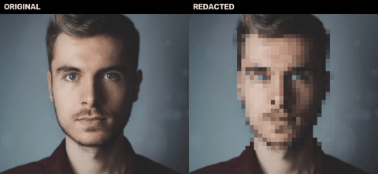
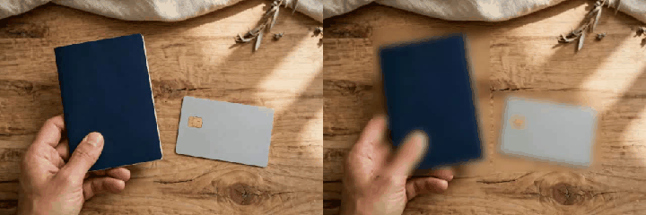
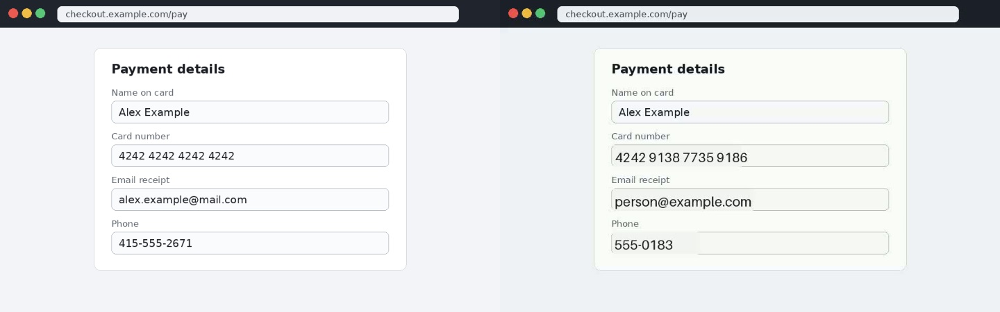
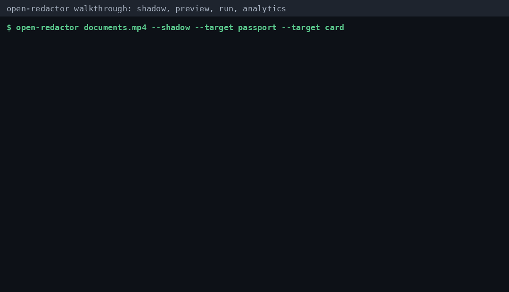
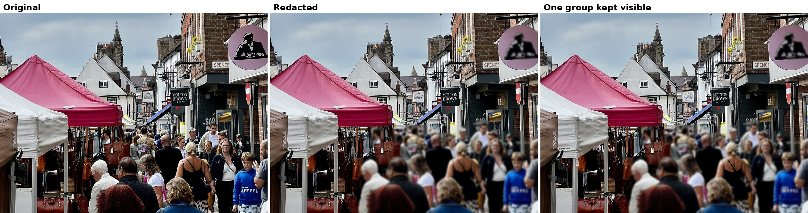
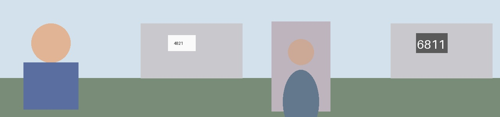

# Open Redactor

**Drop in a clip or a photo, name what to hide, get a share-safe copy out.**

Open Redactor finds people, faces, documents, numbers, codes, and places in your media and covers them with tracking that holds across every frame. Blur it, pixelate it, or swap it for a generated stand-in. Audit before you redact, prove coverage after, and keep private footage on your own machine when it matters.



*Original on the left, redacted output on the right, from a live SAM 3.1 run. The face track held across all 50 frames.*

## Try it in 30 seconds

```bash
pip install open-redactor

open-redactor clip.mp4 --preview --preset family     # 3 second sample first
cat clip.redacted.coverage.txt                        # one result line to trust
open-redactor clip.mp4 --preset family                # the full run
open-redactor clip.mp4 --preset family --mode pixelate  # re-render free, detection is cached
```

## Demos

**Documents in hand.** A passport and a bank card on a desk, found by live SAM 3.1 and blurred with the documents targets. Original on the left, redacted on the right.



**The screen share save.** Nothing physical to detect here, a checkout form in a screen recording. The text layer alone caught the card number, email, and phone, and replace mode swapped in fakes: a different format valid card number, person@example.com, and a 555 number.



**The full loop in one minute.** Shadow audit, preview, full run, and analytics on one clip, from a real terminal transcript. The audit grades the passport critical before anything is touched.



**Real world photos.** A market crowd from Wikimedia Commons: 28 people and 14 faces found in one pass, everyone blurred, and in the third panel one foreground group kept visible with `--keep`. The full pack in [examples/showcase-public](examples/showcase-public) adds a license plate in pixelate mode, a trail group photo, and a trailhead sign, all public licensed photos with attribution.




## What it catches

**People and places, by phrase.** Person, face, license plate, screen, and anything else you name in a short noun phrase. The tracker holds each one across time, pads the mask, and carries it through brief dropouts so the output never flashes clean.

**Sensitive documents.** Passports, credit cards, driver licenses, ID cards, documents, and name badges with the documents preset.

**Printed secrets.** The text layer OCRs frames and covers verified credit card numbers, Social Security numbers, phone numbers, and emails. Card numbers must pass the Luhn check, so order numbers stay untouched.

**Codes.** QR codes and barcodes, which carry Wi-Fi passwords, payment links, and contact cards. Code regions get an opaque fill in blur and pixelate modes because a blurred QR pattern can still be thresholded and decoded.

**Location clues.** Street signs, house numbers, plates, and mailboxes with the location preset.

**Voices.** Audio stays, gets muted, or gets pitch shifted so speech remains but the speaker does not. And with `--speech-pii`, spoken card numbers, Social Security numbers, phone numbers, and emails are found in the transcript and muted in place, verified with the same Luhn and issuing rules as printed text.

## Three ways to hide something

| Mode | What you see | Reach for it when |
| --- | --- | --- |
| blur | A soft gaussian cover | You want the default, clean look |
| pixelate | Chunky mosaic blocks | You want the classic redaction look |
| replace | A generated stand-in | You want the scene to still feel natural |



*Replace mode on the real showcase portrait. The face becomes a neutral synthetic avatar while the photo around it stays untouched. The same treatment swaps plates and house numbers for fake plaques and card numbers for format valid fakes in the reserved test range. Fakes are deterministic per track, so the same person keeps the same stand-in for the whole clip.*

```bash
open-redactor clip.mp4 --mode replace --preset location
```

## Trust first, share second

Redaction fails silently in most tools. Open Redactor is built to show its work.

**Preview.** Render only the first 3 seconds with a contact sheet before committing to a full clip.

**Shadow audit.** Run detection and change nothing. You get a written audit with every element, its frames, and a severity grade, critical for passports and card numbers, high for faces and house numbers, medium for plates and signs.

```bash
open-redactor clip.mp4 --shadow --preset documents --sensitive
```

**Coverage report.** Every real run writes one. Any gap longer than the carry window is flagged NEEDS REVIEW in plain words.

**Analytics.** Every run ends with frames affected, elements by severity, an exposure score, and a machine readable .summary.json next to the output.

A sample audit lives at [examples/shadow-audit-sample.txt](examples/shadow-audit-sample.txt).

## One flag presets

```bash
open-redactor clip.mp4 --preset family        # kids, faces, plates, screens, generous blur
open-redactor clip.mp4 --preset street        # bystanders and plates, pixelated
open-redactor clip.mp4 --preset screen-share  # monitors and faces in recordings
open-redactor clip.mp4 --preset documents     # passports, cards, IDs, badges, strong blur
open-redactor clip.mp4 --preset location      # street signs, house numbers, mailboxes
```

Add `--sensitive` to any run to switch on the text and codes layers together, plus the speech layer when a transcriber is installed. Add `--audio mute` or `--audio pitch` when voices identify someone, and `--speech-pii` when they might say something identifying.

## Run SAM wherever you trust it

SAM 3.1 is an open weights model, so the backend is your choice.

**API, the default.** Meta Model API, best quality with no GPU. Your clip goes to api.meta.ai with your key.

```bash
open-redactor clip.mp4 --backend api
```

**Hosted.** The same request shape pointed at your own endpoint, a team server, or a cloud GPU box.

```bash
open-redactor clip.mp4 --backend hosted --endpoint https://your-host.example/v1/responses
```

**Local.** Grounding DINO plus SAM 2 with IoU tracking on your own hardware. Nothing leaves the device. This is the mode for source footage, medical clips, and family video that should never be uploaded.

```bash
pip install "open-redactor[local]"
open-redactor clip.mp4 --backend local
```

Pixel-perfect SAM masks decode through @meta-sam/parser when Node is present, with a box fallback that still pads and carries safely.

## Plug it into your stack

Open Redactor is a layer, not another app to visit.

**Python API.** Call `redact_media` and `audit_media` from apps, notebooks, Celery workers, Airflow, or Prefect and get structured paths plus analytics back.

```python
from open_redactor import RedactionOptions, redact_media

result = redact_media(
    "interview.mp4",
    options=RedactionOptions(preset="street", sensitive=True, audio_mode="pitch"),
)
print(result.output_path, result.summary)
```

**Agents.** Run `open-redactor-mcp` and MCP clients get `redact_media`, `audit_media`, and `read_redaction_summary` as tools. A direct function-calling adapter lives in `examples/integrations/agent_tool.py`.

**CI and Git.** Use the GitHub Action in this repo to audit pull request media or write redacted release files. Use the pre-commit hook to block a risky video before it lands in a repository.

**HTTP.** Install `open-redactor[server]` and run `open-redactor-server` for team tools and no-code platforms such as n8n, Make, and Zapier.

**Containers.** The included Dockerfile has ffmpeg, the SAM mask parser, OCR, and the server extra ready for CI or a small internal service.

The full setup guide is [docs/integrations.md](docs/integrations.md).

## Photos, formats, and the local page

Photos work exactly like video. JPG, PNG, WebP, BMP, and HEIC or HEIF in, redacted photo out in the same format, with every preset and layer available. HEIC is the iPhone default and needs the one-time extra `pip install "open-redactor[heic]"`.

```bash
open-redactor photo.jpg --preset documents --sensitive
```

Video inputs cover MP4, MOV, MKV, WebM, AVI, and M4V from phones, OBS, browsers, and older cameras. Output is always MP4. Batch mode takes a whole folder. Output naming never overwrites your original or an earlier redacted copy.

Prefer clicking? `open-redactor --ui` opens a drag and drop page that runs only on your own machine at 127.0.0.1.

## The full demo

```bash
# 1. Audit a folder of interview footage without changing a byte
open-redactor interview.mp4 --shadow --preset street --audio pitch

# 2. Preview the fix on the first 3 seconds
open-redactor interview.mp4 --preview --preset street --audio pitch

# 3. Run it, with analytics and a coverage report written next to the output
open-redactor interview.mp4 --preset street --audio pitch --contact-sheet

# 4. Read what was caught
cat interview.redacted.summary.json
```

More worked examples with frames and coverage proof live in [examples/README.md](examples/README.md). The longer guide, privacy notes, and honest limits live in [docs/using-open-redactor.md](docs/using-open-redactor.md).

## Measured, not claimed

An eval harness ships in [eval/](eval/). Three generated clips with exact ground truth score the codes layer, the text layer, and live SAM tracking on recall, mask overlap, coverage continuity, and a leakage metric that measures how much identifying detail survives redaction.

Current reference scores: QR codes recall 1.00 with leakage 0.12, screen form text recall 1.00 with leakage 0.07, and a moving name badge at recall 0.77, including a real 7 frame entry gap the harness caught. The eval README maps the format to EgoBlur, Ref-YouTube-VOS, DAVIS, and MOT so external sets can plug into the same scorer.


## How it compares

| Capability | Open Redactor | deface | EgoBlur | DeepPrivacy 2 | Brighter AI | Presidio |
|---|---|---|---|---|---|---|
| Redact any named class | Yes | No | No | No | No | No |
| Faces and plates | Yes | Faces only | Yes | Faces only | Yes | No |
| Documents and typed PII | Yes | No | No | No | No | Images only |
| QR codes and location clues | Yes | No | No | No | No | No |
| Audio redaction | Yes | No | No | No | No | No |
| Replace with consistent fakes | Yes | No | No | Faces | Yes | No |
| Shadow audit and coverage report | Yes | No | No | No | No | No |
| Published leakage scores | Yes | No | No | No | No | No |
| Fully local mode | Yes | Yes | Yes | Yes | No | Yes |
| Open source | Apache-2.0 | MIT | Research | Research | Closed | MIT |

Full comparison with the rows where the specialists win: [docs/comparison.md](docs/comparison.md).


## Why this exists

**Thesis:** Consumer video redaction is either manual or enterprise-priced and a prompt-driven open-source CLI makes share-safe video a one-command default.

**Value-add:** Real video tracking quality without per-frame manual work plus a local mode that keeps private footage off any API.

## How it stays covered

A detector that drops a face for two frames leaks those two frames. So the pipeline pads every mask by a margin, carries tracks forward after they vanish, smooths mask edges over time, fills single-frame gaps, and flags any longer gap in the coverage report instead of hiding it. Defaults are a product decision too: person, face, license plate, and screen run when you name nothing.

## CLI reference

```text
open-redactor input.mp4 [--output out.mp4]
  --target PHRASE (repeatable)      --targets-default  --add-target PHRASE
  --preset family|street|screen-share|documents|location
  --mode blur|pixelate|replace      --strength N       --mask-margin N  --carry-frames N
  --preview                         --shadow           --contact-sheet
  --report (default)                --no-report
  --sensitive                       --pii-text         --codes
  --keep TRACK (repeatable)         --exclude TRACK (repeatable)
  --audio keep|mute|pitch          --pitch-factor 0.8
  --speech-pii                      --transcript transcript.json
  --backend api|hosted|local        --provider sam|grounding-sam
  --endpoint URL                    --api-key-env MODEL_API_KEY
  --no-cache                        --batch            --ui
```

Exit code is 0 on success. A run that finds zero matches still exits 0 and writes a clean copy with a log line saying nothing matched.

Blur strength adapts to region size. A fixed kernel leaves a large plate readable, so regions bigger than a face get a proportionally stronger kernel in their own layer while faces keep the strength you asked for. Batch runs also write one `batch-summary.json` next to the per-file summaries, and every summary JSON records `sam_mask_source` as pixel, mixed, or box so mask quality is checkable after the fact. Run `open-redactor doctor` for a one-screen report of what this machine can and cannot do, with the install line for anything missing.

## Keep one person visible

Run a shadow audit first and the coverage report names every track, for example `person:0` and `person:1`. Then rerun with `--keep person:0` to leave that one person visible while everyone else stays redacted, or `--exclude person:1` to drop a track that turned out to be a false positive. Both flags repeat, both accept globs like `person:*`, and both work on photos too. Anything left visible is listed in the coverage report and the summary JSON, so the exception is part of the record.

Integration commands use the same engine:

```text
open-redactor-mcp       # MCP tools for agent suites over stdio
open-redactor-audit     # audit files and fail on configured severity
open-redactor-server    # optional HTTP wrapper on 127.0.0.1 by default
open-redactor-doctor    # environment check with a fix line per missing piece
```

## Install

```bash
pip install open-redactor
pip install "open-redactor[local]"   # optional local models
pip install "open-redactor[pii]"     # optional text scanning, also needs the tesseract binary
pip install "open-redactor[server]"  # optional HTTP integration
```

You need ffmpeg and ffprobe on your PATH. From source: clone this repo and `pip install -e .`

## Project layout

- `cli.py` the command line, presets, and routing for video and photos
- `pipeline.py` and `image_pipeline.py` ingest, detection, padding, rendering, reports
- `sam_client.py` the SAM 3.1 API and hosted client with caching
- `local_gsam.py` Grounding DINO plus SAM 2 local provider with IoU tracking
- `masks.py` padding, carry-forward, smoothing, and coverage reports
- `pii.py`, `codes.py` the text and codes layers
- `analytics.py`, `replace.py` severity, summaries, shadow audits, and generated stand-ins
- `api.py` the public Python integration API
- `mcp_server.py`, `server.py`, `audit_gate.py` agent, HTTP, CI, and pre-commit surfaces

## License

Apache-2.0. See LICENSE.
