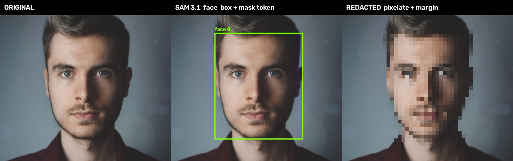
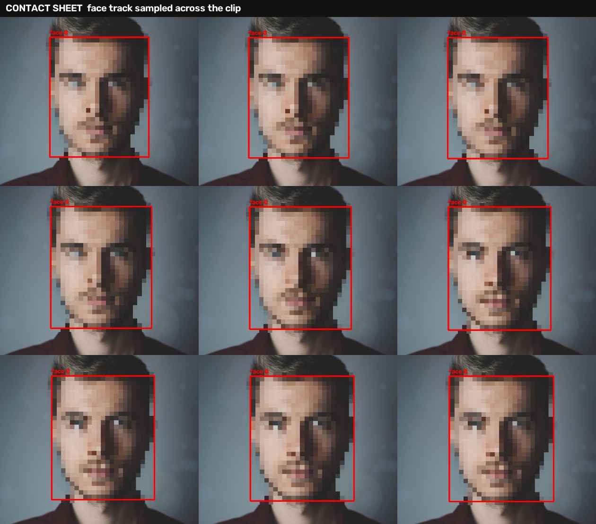
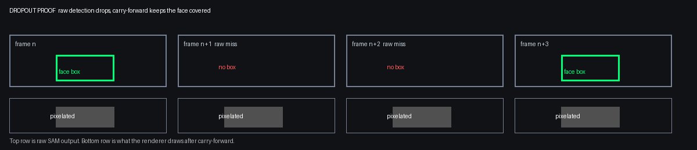
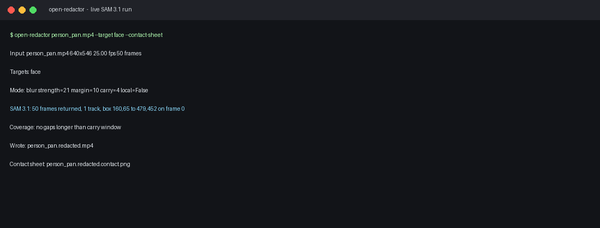

# Open Redactor

Drop in a clip, name what to hide, get a redacted MP4 out.

Open Redactor is an open-source CLI that makes video share-safe. It uses SAM 3.1 detection, segmentation, and identity-preserving video tracking to blur or pixelate people, faces, plates, screens, or any short noun phrase you name.


Original on the left, redacted output on the right. Face track comes from a live SAM 3.1 video call. See the showcase below for stills and the full contact sheet.

## Try it in 30 seconds

Four commands show the whole loop. Preview, check coverage, run the preset, then re-render for free from cache.

```bash
pip install open-redactor

# 1. Preview the first 3 seconds with a contact sheet and coverage report
open-redactor clip.mp4 --preview --preset family

# 2. Read the result line in the coverage report
cat clip.redacted.coverage.txt

# 3. Run the full clip
open-redactor clip.mp4 --preset family --contact-sheet

# 4. Change only the look and re-render, detection comes from cache
open-redactor clip.mp4 --preset family --mode pixelate --strength 24
```

Step 4 prints "SAM cache hit" and skips the API call. Same tracks, new look, render time only.

New here? Read [docs/using-open-redactor.md](docs/using-open-redactor.md) for the local page, privacy notes, and honest limits. Worked examples with frames and coverage proof live in [examples/README.md](examples/README.md).


## Thesis

**Thesis:** Consumer video redaction is either manual or enterprise-priced and a prompt-driven open-source CLI makes share-safe video a one-command default.

## Value-add

**Value-add:** Real video tracking quality without per-frame manual work plus a local mode that keeps private footage off any API.

## Showcase

Live SAM 3.1 run on a short public portrait clip. Phrase was face. The API returned one stable track across all 50 frames with box and one_bit mask tokens on every frame.

Three views of the same frame. Original, SAM box with the mask token noted, and redacted output with margin and pixelation applied.



Contact sheet sampled across the clip. Red outlines mark the redaction zones so a human can spot a miss before sharing.



Dropout proof. When raw detection drops for a frame or two, carry-forward keeps the last mask in place so the output never flashes clean.



Terminal view of a live run. Resolved targets, frame count, track summary, and output paths print before and after rendering.



Full resolution files live in examples/media. The raw SAM output excerpt with box tokens lives in docs/sam-output-excerpt.txt.

## Use cases

Family sharing. Vacation clips, school events, and backyard video where other kids, license plates, and house numbers enter the frame by accident. Defaults cover person, face, plate, and screen in one pass.

Creators. Street interviews, vlogs, and product demos where bystanders, monitors, and vehicle plates need to be covered before posting. One command replaces timeline work.

Journalists and researchers. Field recordings and interview footage where faces, name badges, and screens carry source risk. Local mode keeps sensitive footage off any API.

Work and support. Screen recordings, warehouse and retail footage, and bug reports that show customer data on monitors. Scriptable batch mode fits review queues.

Public data and research sharing. Dashcam clips, real estate walkthroughs, and dataset releases where plates, faces, and addresses must be removed at scale. Contact sheets give reviewers a fast coverage check.

Each scenario maps to the same primitive. Name the class in a short noun phrase and the tracker holds it across time.

## Trust pack

Preview before you commit. Coverage you can audit. Masks that follow the shape.

Preview mode renders only the first 3 seconds plus a contact sheet and a coverage report. Check the sample, then run the full clip with confidence.

```bash
open-redactor input.mp4 --preview --target face
open-redactor input.mp4 --target face
```

Coverage report writes next to every output unless you pass --no-report. It lists total frames, detected frames per track, span, longest internal gap, and any gap longer than the carry window flagged as NEEDS REVIEW. The result line prints in the terminal so you see it without opening the file.

Pixel-perfect masks use the one_bit raster from the SAM mask token when Node and @meta-sam/parser are available. Install once with npm install @meta-sam/parser and the Python pipeline will decode rasters and place them inside the SAM box. When the parser is not present it falls back to box masks and logs that choice. Either way padding, carry-forward, and smoothing still apply.


## Ease pack

Presets give one flag instead of a page of settings.

```bash
open-redactor input.mp4 --preset family
open-redactor input.mp4 --preset street
open-redactor input.mp4 --preset screen-share
```

Family uses generous blur, street pixelates people and plates, screen-share blurs screens and faces. Rendering prints progress with an ETA. SAM results are cached under your home cache folder so changing blur strength and re-rendering does not pay for detection again, use --no-cache to force a fresh call. Output naming never overwrites the original or an earlier redacted file, a suffix is added instead. A local drag and drop page is available with open-redactor --ui and binds only to 127.0.0.1. Audio is still not redacted, so check voices before sharing.

## Quick start

```bash
pip install open-redactor
open-redactor input.mp4
```

That runs the default set of person, face, license plate, and screen and writes `input.redacted.mp4`.

Name what to hide:

```bash
open-redactor input.mp4 --target "license plate" --target "face"
open-redactor input.mp4 --mode pixelate --strength 24
open-redactor input.mp4 --mask-margin 12 --carry-frames 5 --contact-sheet
```

## Sensitive documents

Passports, cards, and IDs need two layers. The documents preset covers the objects, passport, credit card, driver license, id card, and document, with strong blur. The text layer covers what is printed on them.

```bash
open-redactor clip.mp4 --preset documents --pii-text
```

--pii-text OCRs sampled frames and blurs verified card numbers, US Social Security numbers, phone numbers, and emails where they appear. Card numbers must pass the Luhn check and SSNs must pass issuing rules, so random long numbers do not trigger false blurs. Text scanning needs pip install "open-redactor[pii]" plus the tesseract binary, and it skips cleanly with a message when they are missing.


## Where SAM runs

SAM 3.1 is open weights, so the backend is a choice, not an assumption. API is the Meta Model API and works today with no GPU. Hosted points the same request at your own endpoint with --backend hosted and --endpoint. Local runs Grounding SAM, Grounding DINO plus SAM 2 with IoU tracking, on your own hardware so footage never leaves the device. Install it with pip install "open-redactor[local]". Full notes in [docs/using-open-redactor.md](docs/using-open-redactor.md).

```bash
open-redactor clip.mp4 --backend api
open-redactor clip.mp4 --backend hosted --endpoint https://your-host.example/v1/responses
open-redactor clip.mp4 --backend local --provider grounding-sam
```


## Defaults

Defaults matter more than options. SAM finds pixels and does not decide what should be hidden so the default set is a product decision.

- person covers full bodies in frame
- face covers close-ups where the body crop misses the head
- license plate covers parked and moving vehicles
- screen covers phones, laptops, and monitors that may show private content

Running with no phrase runs the default set. Every run prints the resolved target list before processing starts.

## CLI

```text
open-redactor input.mp4
open-redactor input.mp4 --output share-safe.mp4
open-redactor input.mp4 --target "license plate" --target "face"
open-redactor input.mp4 --targets-default --add-target "whiteboard"
open-redactor input.mp4 --mode pixelate --strength 24
open-redactor input.mp4 --mask-margin 12 --carry-frames 5
open-redactor input.mp4 --contact-sheet
open-redactor input.mp4 --preview --target face
open-redactor input.mp4 --local
open-redactor input.mp4 --api-key-env MODEL_API_KEY
open-redactor ./clips --batch --contact-sheet
```

Key flags:

- --output sets the output path and defaults to the input name plus a redacted suffix
- --target adds one phrase and can be repeated
- --targets-default starts from the default set
- --add-target adds one phrase on top of the defaults
- --mode picks blur or pixelate and defaults to blur
- --strength controls blur radius or pixel block size
- --mask-margin pads every mask by this many pixels and defaults to 10
- --carry-frames holds a track for this many frames after it vanishes and defaults to 4
- --contact-sheet writes a PNG grid of redacted sample frames
- --preview renders only a 3 second sample plus contact sheet and coverage report
- --report writes a coverage report next to the output and is on by default
- --no-report skips the coverage report
- --local runs open weights on device and sends nothing to the API
- --api-key-env names the environment variable that holds the API key
- --batch treats the input as a directory and processes each MP4 inside

Exit code is 0 on success and non-zero on failure. A run that finds zero matches still exits 0 and writes a copy with a log line that says nothing matched.

## SAM 3.1 API mode

API mode posts to https://api.meta.ai/v1/responses with model sam-3.1. Set your key in an environment variable and name it with --api-key-env. The CLI streams video so frames arrive as server-sent events until response.completed and uses metadata mask_encoding one_bit. Results return in output_text as special tokens with a frame marker, an object ordinal, a box, and a mask token per object per frame. A live run on 2026-10-01 returned tokens such as box 160,65 to 479,452 on a 640 by 546 frame with one stable face track across 50 frames. When Node and @meta-sam/parser are present the pipeline decodes the one_bit raster for pixel-perfect edges and falls back to box masks otherwise.

Local mode uses the open SAM weights directly and skips the API entirely. The CLI hides the difference behind one flag.

## Failure mode

Missed frames leak identity. A detector that drops a face for two frames leaves those two frames fully exposed and a viewer can pause on them. Single-frame accuracy is not the bar. Continuous coverage is the bar.

Mitigations built into the pipeline:

- Pad masks by a margin so a slightly tight mask still covers hair, ears, and plate edges
- Carry tracks forward a few frames after the last detection so brief dropouts stay covered
- Smooth mask edges over time so masks do not flicker or shrink for one frame
- Interpolate across single-frame gaps inside an otherwise continuous track
- Fail loud on coverage gaps by logging any track gap longer than the carry window
- Contact sheet review so a human can spot a missed region before sharing

If SAM returns no mask for a frame inside a known track window, the renderer keeps the last known mask rather than rendering the frame clean.

## Install from source

```bash
git clone https://github.com/jurayh/open-redactor
cd open-redactor
pip install -e .
```

You need ffmpeg and ffprobe on your PATH.

## Project layout

- src/open_redactor/cli.py holds the CLI entry point
- src/open_redactor/pipeline.py holds ingest, segment and track, pad and smooth, render, and contact sheet
- src/open_redactor/sam_client.py holds the SAM 3.1 API client and local stub
- src/open_redactor/masks.py holds mask padding, carry-forward, smoothing, and gap fill helpers
- tests holds unit tests for masks and CLI wiring

## License

Apache-2.0. See LICENSE.

## Roadmap notes

v1 is CLI first, MP4 in and MP4 out, audio preserved, blur and pixelate modes, per-class phrases, optional contact sheet, and optional local mode. Audio redaction, real-time mode, GUI, and formats beyond MP4 are out of scope for v1.
